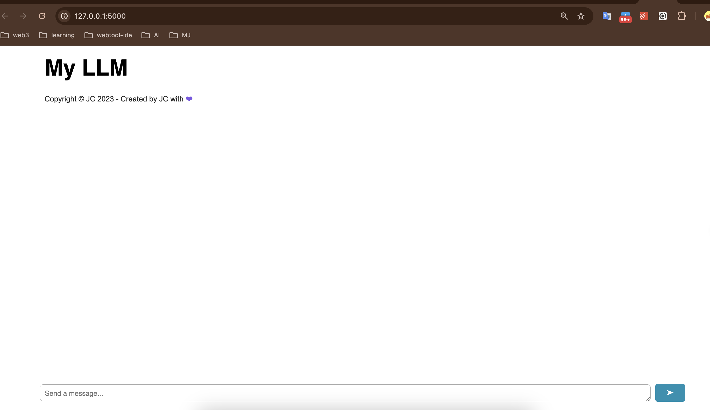

# Integrating your Chatbot into a Web Interface

## Introduction

In this lab, you will learn to set up a back-end server and integrate your chatbot into a web application.

## Learning objectives

After completing this lab, you will be able to:

* Set up your back-end server
* Integrate your chatbot into your Flask server
* Communicate with the back-end using a web page

## Prerequisites

This section assumes you know how to build the simple terminal chatbot explained in the first lab.

There are two things you must build to create your ChatGPT-like website:

1. A back-end server that hosts your chatbot
2. A front-end webpage that communicates with your back-end server

Without further ado, let's get started!

## Step 1: Hosting your chatbot on a backend server

### What is a backend server?

A backend server is like the brain behind a website or application. In this case, the backend server will receive prompts from your website, feed them into your chatbot, and return the output of the chatbot back to the website, which will be read by the user.

### Hosting a simple backend server using Flask

*Note: Consider using a requirements.txt file*

`flask` is a Python framework for building web applications with Python. It provides a set of tools and functionalities to handle incoming requests, process data, and generate responses, making it easy to power your website or application.

### Prerequisites

For all terminal interactions in this lab (such as running python files or installing packages), you will use the built-in terminal that comes with Cloud IDE. You may launch the terminal by either:

* Pressing `Ctrl + <span>` `, or
* By selecting Terminal –> New Terminal from the toolbar at the top of the IDE window on the right.

In your terminal, let's install the following requisites:

```bash
python3.11 -m pip install flask
python3.11 -m pip install flask_cors
```

### Setting up the server

Next, you will create a script that stores your flask server code.

To create a new Python file, Click on `File Explorer`, then right-click in the explorer area and select `New File`. Name this new file `app.py`.

Let's take a look at how to implement a simple flask server:

```python
from flask import Flask

app = Flask(__name__)

@app.route('/')
def home():
    return 'Hello, World!'

if __name__ == '__main__':
    app.run()
```

Paste the above code in the `app.py` file you just created and save it.

In this code:

* You import the `Flask` class from the `flask` module.
* You create an instance of the `Flask` class and assign it to the variable `app`.
* You define a route for the homepage by decorating the `home()` function with the `@app.route()` decorator. The function returns the string 'Hello, World!'. This means that when the user visits the URL where the website is hosted, the backend server will receive the request and return 'Hello, World!' to the user.
* The `if __name__ == '__main__':` condition ensures that the server is only run if the script is executed directly, not when imported as a module.
* Finally, you call `app.run()` to start the server.

```python
python3.11 app.py
```

Save this code in a Python file, for example, app.py, and run it by typing `python app.py` in the terminal. By default, Flask hosts the server at [http://127.0.0.1:5000/](http://127.0.0.1:5000/) (which is equivalent to [http://127.0.0.1:5000/](http://127.0.0.1:5000/)).

With this command, the Flask server will start running. If you run this server on your local machine, then you can access it by visiting [http://127.0.0.1:5000/](http://127.0.0.1:5000/) or [http://localhost:5000/](http://localhost:5000/) in your web browser.

Let's add the following routes to try it out:

```python
@app.route('/bananas')
def bananas():
    return 'This page has bananas!'
  
@app.route('/bread')
def bread():
    return 'This page has bread!'
```

Now, let's stop our app using `Ctrl + C` in the terminal and re-run with `flask run`. Then, let's visit both of these routes at http://`<HOST>`/bananas and http://`<HOST>`/bread. Here's what you should see:

Okay - now that you've demonstrated how routes work, you can remove these two routes (bananas and bread) from your `app.py` as you won't be using them.

Before proceeding, you'll also add two more lines of code to your program to mitigate CORS errors - a type of error related to making requests to domains other than the one that hosts this webpage.

You'll be modifying your code as follows:

```python
from flask import Flask
from flask_cors import CORS		# newly added

app = Flask(__name__)
CORS(app)				# newly added

@app.route('/')
def home():
    return 'Hello, World!'

if __name__ == '__main__':
    app.run()
```

### Integrating your chatbot into your Flask server

Now that you have your Flask server set up, let's integrate your chatbot into your Flask server.

As stated at the beginning, this lab assumes you've completed the first lab of this guided project on how to create your own simple chatbot.

First, you'll install the requisites

```python
python3.11 -m pip install transformers torch
```

Next, let’s copy the code to initialize your chatbot from lab 1 and place it at the top of your script. You also must import the necessary libraries for your chatbot.

```python
from transformers import AutoModelForSeq2SeqLM
from transformers import AutoTokenizer
```

```python
model_name = "facebook/blenderbot-400M-distill"
model = AutoModelForSeq2SeqLM.from_pretrained(model_name)
tokenizer = AutoTokenizer.from_pretrained(model_name)
conversation_history = []
```

Next, you'll need to import a couple more modules to read the data.

```python
from flask import request
import json
```

Before implementing the actual function though, you need to determine the structure you expect to receive in the incoming HTTP request.

Let's define your expected structure as follows:

```json
{
    'prompt': 'message'
}
```

Now implement your chatbot function. Again, you'll copy code over from your chatbot implementation from the first lab.

```python
@app.route('/chatbot', methods=['POST'])
def handle_prompt():
    # Read prompt from HTTP request body
    data = request.get_data(as_text=True)
    data = json.loads(data)
    input_text = data['prompt']

    # Create conversation history string
    history = "\n".join(conversation_history)

    # Tokenize the input text and history
    inputs = tokenizer.encode_plus(history, input_text, return_tensors="pt")

    # Generate the response from the model
    outputs = model.generate(**inputs, max_length= 60)  # max_length will acuse model to crash at some point as history grows

    # Decode the response
    response = tokenizer.decode(outputs[0], skip_special_tokens=True).strip()

    # Add interaction to conversation history
    conversation_history.append(input_text)
    conversation_history.append(response)

    return response
```


The only new thing you've done uptil now is read the prompt from the HTTP request body. You've copied everything else from your previous chatbot implementation!

Perfect, now before testing your application, here's what the final version of your code looks like:

```python
from flask import Flask, request, render_template
from flask_cors import CORS
import json
from transformers import AutoModelForSeq2SeqLM, AutoTokenizer

app = Flask(__name__)
CORS(app)

model_name = "facebook/blenderbot-400M-distill"
model = AutoModelForSeq2SeqLM.from_pretrained(model_name)
tokenizer = AutoTokenizer.from_pretrained(model_name)
conversation_history = []

@app.route('/chatbot', methods=['POST'])
def handle_prompt():
    data = request.get_data(as_text=True)
    data = json.loads(data)
    input_text = data['prompt']

    # Create conversation history string
    history = "\n".join(conversation_history)

    # Tokenize the input text and history
    inputs = tokenizer.encode_plus(history, input_text, return_tensors="pt")

    # Generate the response from the model
    outputs = model.generate(**inputs, max_length= 60)  # max_length will cause the model to crash at some point as history grows

    # Decode the response
    response = tokenizer.decode(outputs[0], skip_special_tokens=True).strip()

    # Add interaction to conversation history
    conversation_history.append(input_text)
    conversation_history.append(response)

    return response

if __name__ == '__main__':
    app.run()
```

Now let's test your implementation by using `curl` to make a POST request to `<HOST>`/chatbot with the following request body: {'prompt':'Hello, how are you today?'}.

Open a new terminal: Select terminal tab –> open new terminal

```python
curl -X POST -H "Content-Type: application/json" -d '{"prompt": "Hello, how are you today?"}' 127.0.0.1:5000/chatbot
```

Here's the output of the above code:

```python
I am doing very well today as well. I am glad to hear you are doing well.
```

f you got a similar response, then congratulations! You have successfully created a Flask backend server with an integrated chatbot!

After you finish, press `cntrl + c` to stop the server.

# Communicating with your backend using a webpage

In this section, you'll download a template chatbot webpage and configure it to make requests to your backend server.

First, let's clone a repository that has a template website and install your required libraries.
If your flask app is running, terminate it with `Ctrl + C` and run the following lines in the terminal:

```python
git clone https://github.com/ibm-developer-skills-network/LLM_application_chatbot
python3.11 -m pip install -r LLM_application_chatbot/requirements.txt
```


If the operations are complete with no errors, then you have successfully obtained a copy of the template repository.

The file structure of this repo should be as follows:

* ibm-chatbot-template/
  * static/
    * script.js
    * < other assets >
  * templates/
    * index.html

Let's move your flask app `app.py` to the `LLM_application_chatbot/` folder so that you can host `index.html` on your server.

Both `app.py` and the `LLM_application_chatbot/` folder should be in `/home/project`. You can move `app.py` into `ibm_chatbot_template/` by running the following line in the terminal:

```python
mv app.py LLM_application_chatbot/
```

After adding your flask app, the file structure should be as follows:

* LLM_application_chatbot/
  * *app.py*
  * static/
    * script.js
    * < other assets >
  * templates/
    * index.html

Now, let's modify your `app.py` so that you host index.html at `<HOST>`/. You can achieve this by adding the following route to your code:

```python
@app.route('/', methods=['GET'])
def home():
    return render_template('index.html')
```

After adding the code, you can run your flask app with the following:

```python
flask run
```




This template already has JavaScript code that emulates a chatbot interface. When you type a message and hit send, the website template does the following:

1. Enter your input message into a text bubble
2. Send your input to an endpoint (by default, this is set to [www.example.com](http://www.example.com/) in the template)
3. Wait for the response from the endpoint and put the response in a text bubble

You will not implement such an interface as it is beside the purpose of this lab.

Instead, you will make sure that in step 2, you send the user input to the route you created for your chatbot earlier: [http://127.0.0.1:5000/chatbot](http://127.0.0.1:5000/chatbot).

To send the input, you open `/static/script.js` and find where the endpoint is set.


Let's change this endpoint to your chatbot route. In this example, [www.example.com](http://www.example.com/) will replace

```python
http://127.0.0.1:5000/chatbot
```

And that should be it! Before testing your code, let's glance at the final version of your flask app:

```python
from flask import Flask, request, render_template
from flask_cors import CORS
import json
from transformers import AutoModelForSeq2SeqLM, AutoTokenizer

app = Flask(__name__)
CORS(app)

model_name = "facebook/blenderbot-400M-distill"
model = AutoModelForSeq2SeqLM.from_pretrained(model_name)
tokenizer = AutoTokenizer.from_pretrained(model_name)
conversation_history = []

@app.route('/', methods=['GET'])
def home():
    return render_template('index.html')


@app.route('/chatbot', methods=['POST'])
def handle_prompt():
    data = request.get_data(as_text=True)
    data = json.loads(data)
    print(data) # DEBUG
    input_text = data['prompt']
  
    # Create conversation history string
    history = "\n".join(conversation_history)

    # Tokenize the input text and history
    inputs = tokenizer.encode_plus(history, input_text, return_tensors="pt")

    # Generate the response from the model
    outputs = model.generate(**inputs)

    # Decode the response
    response = tokenizer.decode(outputs[0], skip_special_tokens=True).strip()

    # Add interaction to conversation history
    conversation_history.append(input_text)
    conversation_history.append(response)

    return response

if __name__ == '__main__':
    app.run()
```

Okay! Now let's test your app by stopping it first with `Ctrl + C` (if it's running) and restarting it with `flask run`.


Congratulations! If your output is similar, then you have just created your own chatbot website!
