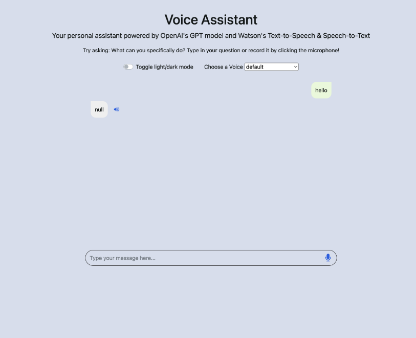

# Create a Voice Assistant with OpenAI's GPT-3 and IBM Watson

## Introduction

Welcome to this guided project on creating a voice assistant using OpenAI and IBM Watson Speech Libraries for Embed. The guided project takes you through building a virtual assistant that can take voice input, convert it to text using speech-to-text technology, send the text to OpenAI's GPT-3 model, receive a response, convert it to speech using text-to-speech technology and finally play it back to the user. The voice assistant will have a responsive front-end using HTML, CSS, and JavaScript, and a reliable back-end using Flask.

Click [here](https://ai-personal-assistant.xs6r134s1i6.us-east.codeengine.appdomain.cloud/) to play with a demo of the final application that you will create!

By the end of the course, you will have a deep understanding of voice assistants and the skills to create your own AI-powered assistant that can communicate through voice input and output. You will also have a strong foundation in web development using Python, Flask, HTML, CSS, and JavaScript, and a finished full stack impressive application!

Before you begin, let's give some context of each topic.

### OpenAI

OpenAI is a research organization that aims to promote and develop friendly artificial intelligence in a way that benefits humanity as a whole. One of their key projects is GPT-3, which is a state-of-the-art natural language processing model. You will be using GPT-3 in your assistant to allow it to understand and respond to a wide range of user inputs.

### IBM Watson speech libraries for embed

IBM Watson® Speech Libraries for Embed are a set of containerized text-to-speech and speech-to-text libraries designed to offer our IBM partners greater flexibility to infuse the best of IBM Research® technology into their solutions. Now available as embeddable AI, partners gain greater capabilities to build voice transcription and voice synthesis applications more quickly and deploy them in any hybrid multi-cloud environment. These technologies allow the assistant to communicate with users through voice input and output.

### Voice assistants

A virtual assistant is a program designed to simulate conversation with human users, especially over the Internet using natural human voice. Assistants can be used in a variety of industries, including customer service, e-commerce, and education.

### Python (Flask)

Python is a popular programming language that is widely used in web development and data science. Flask is a web framework for Python that makes it easy to build web applications. You will be using Python and Flask to build the backend of your voice assistant. Python is a powerful language that is easy to learn and has a large ecosystem of libraries and frameworks that can be leveraged in projects like yours.

### HTML - CSS - Javascript

HTML (Hypertext Markup Language) is a markup language used to structure content on the web. CSS (Cascading Style Sheets) is a stylesheet language used to describe the look and formatting of a document written in HTML. Javascript is a programming language that is commonly used to add interactivity to web pages. Together, these technologies allow us to build a visually appealing and interactive frontend for your assistant. Users will be able to interact with the voice assistant through a web interface that's built using HTML, CSS, and Javascript.

## Learning objectives

At the end of this project, you will be able to:

* Explain the basics of voice assistants and their various applications
* Set up a development environment for building an assistant using Python, Flask, HTML, CSS, and Javascript
* Implement speech-to-text functionality to allow the assistant to understand voice input from users
* Integrate the assistant with OpenAI's GPT-3 model to give it a high level of intelligence and the ability to understand and respond to user requests
* Implement text-to-speech functionality to allow the assistant to communicate with users through voice output
* Combine all the above components to create a functional assistant that can take voice input and provide a spoken response
* (Optional) Deploy the assistant to a web server for use by a wider audience

## Prerequisites

Having knowledge of the basics of HTML/CSS, Javascript, and Python are nice to have but not essential. We will do our best in explaining each step of the process as well as any code shown along the way.

# Step 1: Understanding the interface

In this project, the goal is to create an interface that allows communication with a voice assistant, and a backend to manage the sending and receiving of responses.

The frontend will use HTML, CSS and Javascript with popular libraries such as Bootstrap for basic styling, Font Awesome for icons and JQuery for efficient handling of actions. The user interface will be similar to other voice assistant applications, like Google Assistant. The code for the interface is provided and the focus of the course is on building the voice assistant and integrating it with various services and APIs. The provided code will help you to understand how the frontend and backend interact, and as you go through it, you will learn about the important parts and how it works, giving you a good understanding of how the frontend works and how to create this simple web page.

### HTML, CSS, and Javascript

The `index.html` file is responsible for the layout and structure of the web interface. This file contains the code for incorporating external libraries such as JQuery, Bootstrap, and FontAwesome Icons, as well as the CSS (`style.css`) and Javascript code (`script.js`) that control the styling and interactivity of the interface.

The `style.css` file is responsible for customizing the visual appearance of the page's components. It also handles the loading animation using CSS keyframes. Keyframes are a way of defining the values of an animation at various points in time, allowing for a smooth transition between different styles and creating dynamic animations.

The `script.js` file is responsible for the page's interactivity and functionality. It contains the majority of the code and handles all the necessary functions such as switching between light and dark mode, sending messages, and displaying new messages on the screen. It even enables the users to record audio.

### Images of UI

Here are some images of the frontend you received.

#### Light mode

This demonstrates how the base code works. It'll just return `null` as a response.




#### Dark mode

Once you go through the project, you'll complete the assistant and it will be able to give clear responses as shown below:


# Step 2: Understanding the server

The server is how the application will run and communicate with all your services. Flask is a web development framework for Python and can be used as a backend for the application. It is a lightweight and simple framework that makes it quick and easy to build web applications.

With Flask, you can create web pages and applications without needing to know a lot of complex coding or use additional tools or libraries. You can create your own routes and handle user requests, and it also allows you to connect to external APIs and services to retrieve or send data.

This guided project uses Flask to handle the backend of your voice assistant. This means that you will be using Flask to create routes and handle HTTP requests and responses. When a user interacts with the voice assistant through the frontend interface, the request will be sent to the Flask backend. Flask will then process the request and send it to the appropriate service.

The code provided gives the outline for the server in the `server.py` file.


At the top of the file, there are several import statements. These statements are used to bring in external libraries and modules, which will be used in the current file. For instance, `speech_text` is a function inside the `worker.py` file, while `openai` is a package that needs to be installed to use the OpenAI's GPT-3 model. These imported packages, modules and libraries will allow you to access the additional functionalities and methods that they offer, making it easy to interact with the speech-to-text and GPT-3 model in your code.

Underneath the imports, the Flask application is initialized, and a CORS policy is set. A CORS policy is used to allow or prevent web pages from making requests to different domains than the one that served the web page. Currently, it is set to `*` to allow any request.

The `server.py` file consists of 3 functions which are defined as routes, and the code to start the server.

The first route is:

```python
@app.route('/', methods=['GET'])
def index():
    return render_template('index.html')
```


When a user tries to load the application, they initially send a request to go to the `/` endpoint. They will then trigger this `index` function above and execute the code above. Currently, the returned code from the function is a render function to show the `index.html` file which is the frontend interface.

The second and third routes are what will be used to process all requests and handle sending information between the applications.

Finally, the application is started with the `app.run` command to run on port `8080` and have the host be `0.0.0.0` (a.k.a. `localhost`).

The next sections will take you through the process of completing the `process_message_route` and `speech_to_text_route` functions in this file and help you understand how to use the packages and endpoints.


# Step 3: Running the application

Docker allows for the creation of “containers” that package an application and its dependencies together. This allows the application to run consistently across different environments, as the container includes everything it needs to run. Additionally, using a Docker image to create and run applications can simplify the deployment process, as the image can be easily distributed and run on any machine that has Docker installed. This can help to ensure that the application runs in the same way in development, testing, and production environments.

1. Starting the application

This image is quick to build as the application is quite small. These commands first build the application (running the commands in the `Dockerfile`) and tags (names) the built container as `voice-assistant`, then runs it in the foreground on `port 8000`. **You'll need to run these commands everytime you wish to make a new change to one of the files.**

```bash
docker build . -t voice-assistant
docker run -p 8000:8000 voice-assistant
```


Your browser may deny “pop-ups” but please allow them for the new tab to open up.

At this point, the application will run but return `null` for any input.

Once you've had a chance to run and play around with the application, please press `Crtl` (a.k.a. `control (^)` for Mac) and `C` at the same time to stop the container and continue the project.

The application will only run while the container is up. If you make new changes to the files and would like to test them, you will have to rebuild the image.

### 2. Starting Speech-to-Text

Watson Speech-to-Text image that runs automatically in this environment. To access it, use this endpoint URL when you get to Step 4:

```bash
base_url = "https://sn-watson-stt.labs.skills.network"
```

You can test it works by running this query:

```bash
curl https://sn-watson-stt.labs.skills.network/speech-to-text/api/v1/models
```

You should see a list of a few languages it can recognize. Example output is shown below.

```json
{
   "models": [
      {
         "name": "en-US_Multimedia",
         "language": "en-US",
         "description": "US English multimedia model for broadband audio (16kHz or more)",
          ...
      },
      {
         "name": "fr-FR_Multimedia",
         "language": "fr-FR",
         "description": "French multimedia model for broadband audio (16kHz or more)",
          ...
      }
   ]
}
```


### 3. Starting Text-to-Speech

Skills Network provides its own Watson Text-to-Speech image that is run automatically in this environment. To access it, use this endpoint URL when you get to Step 6:

```json
base_url = "https://sn-watson-tts.labs.skills.network"
```

You can test it works by running this query:

```json
curl https://sn-watson-tts.labs.skills.network/text-to-speech/api/v1/voices
```

You should see a list of a bunch of different voices this model can use. Example output is shown below.

```json
{
   "voices": [
      {
         "name": "en-US_EmilyV3Voice",
         "language": "en-US",
         "gender": "female",
         "description": "Emily: American English female voice. Dnn technology.",
         ...
      },
      {
         "name": "en-GB_JamesV3Voice",
         "language": "en-GB",
         "gender": "male",
         "description": "James: British English male voice. Dnn technology.",
         ...
      },
      {
         "name": "en-US_MichaelV3Voice",
         "language": "en-US",
         "gender": "male",
         "description": "Michael: American English male voice. Dnn technology.",
         ...
      },
      {
         "name": "fr-CA_LouiseV3Voice",
         "language": "fr-CA",
         "gender": "female",
         "description": "Louise: French Canadian female voice. Dnn technology.",
         ....
      },
      ...
   ]
}
```


# Step 4: Integrating Watson Speech-to-Text

Speech-to-Text functionality is a technology that converts speech into text using machine learning. It is useful for accessibility, productivity, convenience, multilingual support, and cost-effective solutions for a wide range of applications. For example, being able to take a user's voice as input for a chat application.

Using the embedded Watson Speech-to-Text AI model that was deployed earlier, it is possible to easily convert your speech-to-text by a simple API. This result can then be passed to OpenAI API for generating a response.

### Implementation

You will be updating a function called `speech_to_text` that will take in audio data received from the browser and pass it to the Watson Speech-to-Text API. Open `worker.py` from the explore or by clicking below.

It's important to import the requests library at the top of your `worker.py` file. This library is a simple HTTP request library that you will be using to make API calls to the Watson Speech-to-Text API.

The `speech_to_text` function will take in audio data as a parameter, make an API call to the Watson Speech-to-Text API using the requests library, and return the transcription of the audio data.

**Remember to replace the `...` for the `base_url` variable with the URL for your Speech-to-Text model (for example, `https://sn-watson-stt.labs.skills.network`).**

### Worker.py

```python
def speech_to_text(audio_binary):

    # Set up Watson Speech-to-Text HTTP Api url
    base_url = '...'
    api_url = base_url+'/speech-to-text/api/v1/recognize'

    # Set up parameters for our HTTP reqeust
    params = {
        'model': 'en-US_Multimedia',
    }

    # Set up the body of our HTTP request
    body = audio_binary

    # Send a HTTP Post request
    response = requests.post(api_url, params=params, data=audio_binary).json()

    # Parse the response to get our transcribed text
    text = 'null'
    while bool(response.get('results')):
        print('speech to text response:', response)
        text = response.get('results').pop().get('alternatives').pop().get('transcript')
        print('recognised text: ', text)
        return text
```

#### Explanation

The function simply takes `audio_binary` as the only parameter and then sends it in the body of the HTTP request.

To make an HTTP Post request to Watson Speech-to-Text API, you need the following:

1. **URL** of the API: This is defined as `api_url` in your code and points to the Watson's Speech-to-Text service
2. **Parameters** : This is defined as `params` in your code. It's just a dictionary having one key-value pair i.e. `'model': 'en-US_Multimedia'` which simply tells Watson that you want to use the US English model for processing your speech
3. **Body** of the request: this is defined as `body` and is equal to `audio_binary` since you are sending the audio data inside the body of your POST request.

You then use the requests library to send this HTTP request passing in the url, params, and data(body) to it and then use `.json()` to convert the API's response to json format which is very easy to parse and can be treated like a dictionary in Python.

The structure of the response is as shown below:

```json
{
  "response": {
    "results": {
      "alternatives": {
        "transcript": "Recognised text from your speech"
      }
    }
  }
}
```


Therefore, you check if the response contains any results, and if it does, you extract the text by getting the nested transcript string as shown above. Then return this text.

##### Small tip

Notice the print statements such as  *print(‘response’, response)* , it's always a good idea to print out the data you are receiving from some external place like an API in this case, as it really helps with debugging if something goes wrong.


# Step 5: Integrating OpenAI API

It's time to give your voice assistant a brain! With the power of OpenAI's GPT-3.5 API, you can pass the transcribed text and receive responses that answer your questions.

**Normally, you would need to get an API key by creating an OpenAI account, when using our labs, however this has been taken care for so you can proceed with your project without worrying about it.**

### OpenAI process message function

You will be updating the function called `openai_process_message`, which will take in a prompt and pass it to OpenAI's GPT-3 API to receive a response. Essentially, it's the equivalent of pressing the send button to get a response from ChatGPT.

Go ahead and update the `openai_process_message` function in the `worker.py` file with the following:


### Worker.py

```python
def openai_process_message(user_message):
    # Set the prompt for OpenAI Api
    prompt = "Act like a personal assistant. You can respond to questions, translate sentences, summarize news, and give recommendations."
    # Call the OpenAI Api to process our prompt
    openai_response = openai_client.chat.completions.create(
        model="gpt-3.5-turbo", 
        messages=[
            {"role": "system", "content": prompt},
            {"role": "user", "content": user_message}
        ],
        max_tokens=4000
    )
    print("openai response:", openai_response)
    # Parse the response to get the response message for our prompt
    response_text = openai_response.choices[0].message.content
    return response_text
```


#### Explanation

The function is really simple, thanks to the very easy to use `openai` library.

This is where you can give your personal assistant some personality. In this case you are telling the model to become a personal assistant by: `Act like a personal assistant`, and then giving it specific tasks its capable of doing: `You can respond to questions, translate sentences, summarize news, and give recommendations.`. By adding the original user message afterwards, it gives OpenAI more room to sound genuine. Feel free to change this according to what you require.

Then you call OpenAI's API by using `openai.chat.completions.create` function and pass in the following 3 parameters:

1. `model`: This is the OpenAI model we want to use for processing our prompt, in this case we are using their *gpt-3.5-turbo* model.
2. `messages`: The messages parameter is an array of objects used to define the conversation flow between the user and the AI. Each object represents a message with two key attributes: role (identifying the sender as either “system” for setup instructions or “user” for the actual user query) and content (the message text). The “system” role message instructs the AI on how to behave (for example, acting like a personal assistant), while the “user” role message contains the user's input. This structured approach helps tailor the AI's responses to be more relevant and personalized.
3. `max_tokens`: This is the maximum length of the response we are looking for. 30 tokens correspond to roughly 1-2 sentences. Right now, we are setting it to 4000, which is the maximum value of the tokens that this model supports.

Again, you can definitely tweak these parameters according to your personalized needs and can learn more about them by going to [OpenAI playground](https://beta.openai.com/playground/p/default-marv-sarcastic-chat) where you can test all parameters in real time.

The structure of the response is something like this:

```json
{
  "choices": [
      {"message": {
          content: "The model\'s answer to our prompt",
          ...,
          ...,
      },
      ...,
      ...
    ]
}
```

Hence, you parse the openai_response to extract the answer to your prompt which is `openai_response.choices[0].message.content` and store it in a variable called `response_text`. Finally, you return the `response_text`.


# Step 6: Integrating Watson Text-to-Speech

Time to give your assistant a voice using Text-to-Speech functionality.

Once we have processed the user's message using OpenAI, let's add the final worker function that will convert that response to speech, so you get more personalized feel as the Personal Assistant is going to read out the response to you. Just like other virtual assistants do like Google, Alexa, Siri etc.

### Text-to-Speech function

In the `worker.py` file, the `text_to_speech` function passes data to Watson's Text-to-Speech API to get the data as spoken output.

This function is going to be very similar to `speech_to_text` as you will be utilizing your request library again to make an HTTP request. Let's dive into the code.

**Again, remember to replace the `...` for the `base_url` variable with the URL for your Text-to-Speech model (for example,`https://sn-watson-tts.labs.skills.network`).**

### Worker.py

```python
def text_to_speech(text, voice=""):
    # Set up Watson Text-to-Speech HTTP Api url
    base_url = '...'
    api_url = base_url + '/text-to-speech/api/v1/synthesize?output=output_text.wav'

    # Adding voice parameter in api_url if the user has selected a preferred voice
    if voice != "" and voice != "default":
        api_url += "&voice=" + voice

    # Set the headers for our HTTP request
    headers = {
        'Accept': 'audio/wav',
        'Content-Type': 'application/json',
    }

    # Set the body of our HTTP request
    json_data = {
        'text': text,
    }

    # Send a HTTP Post request to Watson Text-to-Speech Service
    response = requests.post(api_url, headers=headers, json=json_data)
    print('text to speech response:', response)
    return response.content
```

#### Explanation

The function simply takes `text` and `voice` as the parameters. It adds voice as a parameter to the `api_url` if it's not empty or not default. It sends the `text` in the body of the HTTP request.

Similarly, as before, to make an HTTP Post request to Watson Text-to-Speech API, you need the following three elements:

1. **URL** of the API: This is defined as `api_url` in your code and points to Watson's Text to Speech service. This time you also append a voice parameter to the `api_url` if the user has sent a preferred voice in their request.
2. **Headers** : This is defined as `headers` in your code. It's just a dictionary having two key-value pairs. The first is *'Accept':'audio/wav'* which tells Watson that we are sending an audio having *wav* format. The second one is ‘Content-Type’:’application/json’, which means that the format of the body would be *JSON*
3. **Body** of the request: This is defined as `json_data` and is a dictionary containing ‘text’:`text` key-value pair, this text will then be processed and converted to a speech.

We then use the requests library to send this HTTP request passing in the URL, headers, and json(body) to it and then use .json() to convert the API's response to json format so we can parse it.

The structure of the response is something like this:

```json
{
  "response": {
        content: The Audio data for the processed text to speech
    }
  }
}
```

Therefore, we return `response.content` which contains the audio data received.


# Step 7: Putting everything together by creating Flask API endpoints

Now by using the functions we defined in the previous sections; we can connect everything together and complete the assistant.

The changes in this section will be for the server.py file.

The outline has already taken care of the imports for the functions from the `worker.py` file to the `server.py` file. This allows the `server.py` file to access these imported functions from the `worker.py` file.

```python
from worker import speech_to_text, text_to_speech, openai_process_message
```


Now we will be updating two Flask routes, one for converting user's speech-to-text (`speech_to_text_route`) and the other for processing their message and converting the OpenAI's response back to speech (`process_message_route`).

### Speech-to-Text route

This function is very simple, as it only converts the user's speech-to-text using the `speech_to_text` we defined in one of our previous sections and return the response.

#### Code

```python
@app.route('/speech-to-text', methods=['POST'])
def speech_to_text_route():
    print("processing speech-to-text")
    audio_binary = request.data # Get the user's speech from their request
    text = speech_to_text(audio_binary) # Call speech_to_text function to transcribe the speech

    # Return the response back to the user in JSON format
    response = app.response_class(
        response=json.dumps({'text': text}),
        status=200,
        mimetype='application/json'
    )
    print(response)
    print(response.data)
    return response
```


#### Explanation

We start off by storing the `request.data` in a variable called `audio_binary`, as we are sending the binary data of audio in the body of the request from the front end. Then we use our previously defined function `speech_to_text` and pass in the `audio_binary` as a parameter to it. We store the return value in a new variable called `text`.

As our front end expects a JSON response, we create a json response by using the Flask's `app.response_class` function and passing in three arguments:

1. `response`: This is the actual data that we want to send in the body of our HTTP response. We will be using `json.dumps` function and will pass in a simple dictionary containing only one key-value pair -`'text': text`
2. `status`: This is the status code of the HTTP response; we will set it to 200 which essentially means the response is *OK* and that the request has succeeded.
3. `mimetype`: This is the format of our response which is more formally written as `'application/json'` in HTTP request/response.

We then return the `response`.

### Process message route

This function will basically accept a user's message in text form with their preferred voice. It will then use our previously defined helper functions to call the OpenAI's API to process this prompt and then finally convert that response to text using Watson's Text to Speech API and then return this data back to the user.

#### Code

```python
@app.route('/process-message', methods=['POST'])
def process_message_route():
    user_message = request.json['userMessage'] # Get user's message from their request
    print('user_message', user_message)

    voice = request.json['voice'] # Get user's preferred voice from their request
    print('voice', voice)

    # Call openai_process_message function to process the user's message and get a response back
    openai_response_text = openai_process_message(user_message)

    # Clean the response to remove any emptylines
    openai_response_text = os.linesep.join([s for s in openai_response_text.splitlines() if s])

    # Call our text_to_speech function to convert OpenAI Api's reponse to speech
    openai_response_speech = text_to_speech(openai_response_text, voice)

    # convert openai_response_speech to base64 string so it can be sent back in the JSON response
    openai_response_speech = base64.b64encode(openai_response_speech).decode('utf-8')

    # Send a JSON response back to the user containing their message's response both in text and speech formats
    response = app.response_class(
        response=json.dumps({"openaiResponseText": openai_response_text, "openaiResponseSpeech": openai_response_speech}),
        status=200,
        mimetype='application/json'
    )

    print(response)
    return response
```

#### Explanation

We will start by storing user's message in `user_message` by using `request.json['userMessage']`. Similarly, we will also store the user's preferred voice in `voice` by using `request.json['voice']`.

We will then use the helper function we defined earlier to process this user's message by calling `openai_process_message(user_message)` and storing the response in `openai_response_text`. We will then clean this response to remove any empty lines by using a simple one liner function in python, `os.linesep.join([s for s in openai_response_text.splitlines() if s])`.

Once we have this response cleaned, we will now use another helper function we defined earlier to convert it to speech. Therefore, we will call `text_to_speech` and pass in the two required parameters which are `openai_response_text` and `voice`. We will store the function's return value in a variable called `openai_response_speech`.

As the openai_response_speech is a type of audio data, we can't directly send this inside a json as it can only store textual data. Therefore, we will be using something called  *“base64 encoding”* . In simple words, we can convert any type of binary data to a textual representation by encoding the data in base64 format. Hence, we will simply use `base64.b64encode(openai_response_speech).decode('utf-8')` and store the result back to `openai_response_speech`.

Now we have everything ready for our response so finally we will be using the same `app.response_class` function and send in the three parameters required. The `status` and `mimetype` will be exactly the same as we defined them in our previous `speech_to_text_route`. In the response, we will use `json.dumps` function as we did before and will pass in a dictionary as a parameter containing `"openaiResponseText":openai_response_text` and `"openaiResponseSpeech":openai_response_speech`.

We then return the `response`.


# Step 8: Testing your personal assistant

The assistant is now complete and ready to use.

Now that we've updated the code quite considerably, it is a good time to rebuild our docker image and test to see that it is working as expected in this environment.

Assuming the Text-to-Speech and Speech-to-Text model URLs are correctly set, you just need to rebuild the image for the application and rerun it so it has all the latest changes.

This step assumes that you have no running container for the application. If you do, please press `Crtl (^)` and `C` at the same time to stop the container.

```bash
docker build . -t voice-assistant
docker run -p 8000:8000 voice-assistant
```

Then just open the application on a new tab (or if you already have the tab running - refresh that page).
